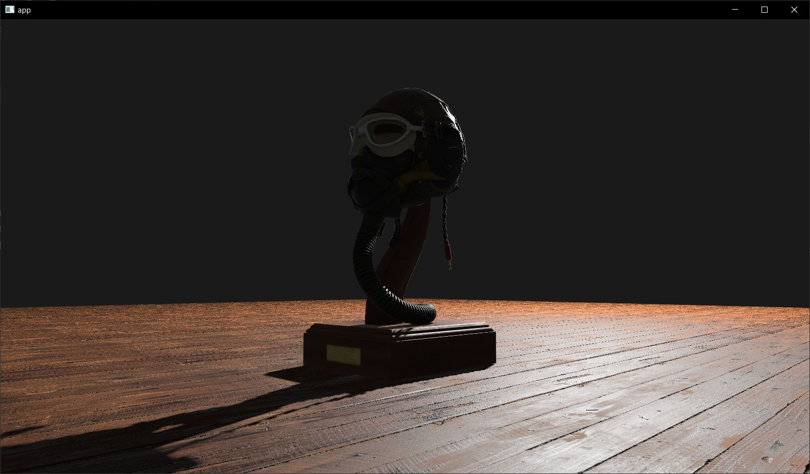

# bevy_mod_mipmap_generator

## A basic mipmap generator for bevy 0.10.


*without mipmaps*


*with mipmaps*

## Note

Bevy supports a [variety of compressed image formats](https://docs.rs/bevy/latest/bevy/render/texture/enum.ImageFormat.html) that can also contain mipmaps. This plugin is intended for situations where the use of those formats is impractical (mostly prototyping/testing). With this plugin, mipmap generation happens slowly on the cpu.

For generating compressed textures ahead of time check out:
- [klafsa](https://github.com/superdump/klafsa)
- [kram](https://github.com/alecazam/kram)
- [toktx](https://github.khronos.org/KTX-Software/ktxtools/toktx.html)
- [compressonator](https://gpuopen.com/compressonator/)
- [basis_universal](https://github.com/BinomialLLC/basis_universal)

In my experience, many of these compressed formats can be used with bevy in `gltf` files. This can be done by converting and replacing the images included in the `gltf` and then setting the mimeType with something like: `"mimeType": "image/ktx2"` (for ktx2)

## Usage

```rust
    .add_plugins(DefaultPlugins)
    // Add MipmapGeneratorPlugin after default plugins
    .add_plugin(MipmapGeneratorPlugin)
    // Add material types to be converted
    .add_system(generate_mipmaps::<StandardMaterial>
```

When materials are created, mipmaps will be created for the images used in the material.

Mipmaps will not be generated for materials found on entities that also have the `NoMipmapGeneration` component.

## Custom Materials
For use with custom materials, just implement the GetImages trait for the custom material.

```rust
pub trait GetImages {
    fn get_images(&self) -> Vec<&Handle<Image>>;
}

impl GetImages for StandardMaterial {
    fn get_images(&self) -> Vec<&Handle<Image>> {
        vec![
            &self.base_color_texture,
            &self.emissive_texture,
            &self.metallic_roughness_texture,
            &self.normal_map_texture,
            &self.occlusion_texture,
        ]
        .into_iter()
        .flatten()
        .collect()
    }
}
```

## TODO
- Support more texture formats.
- Support re-running if images are updated.
